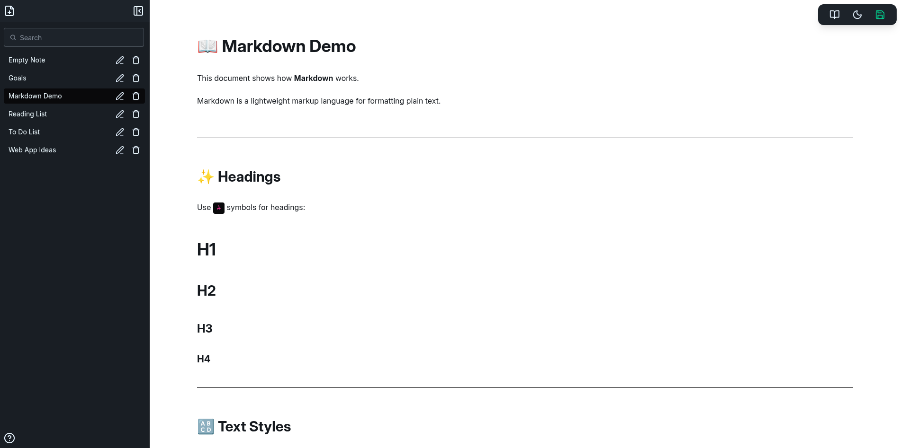
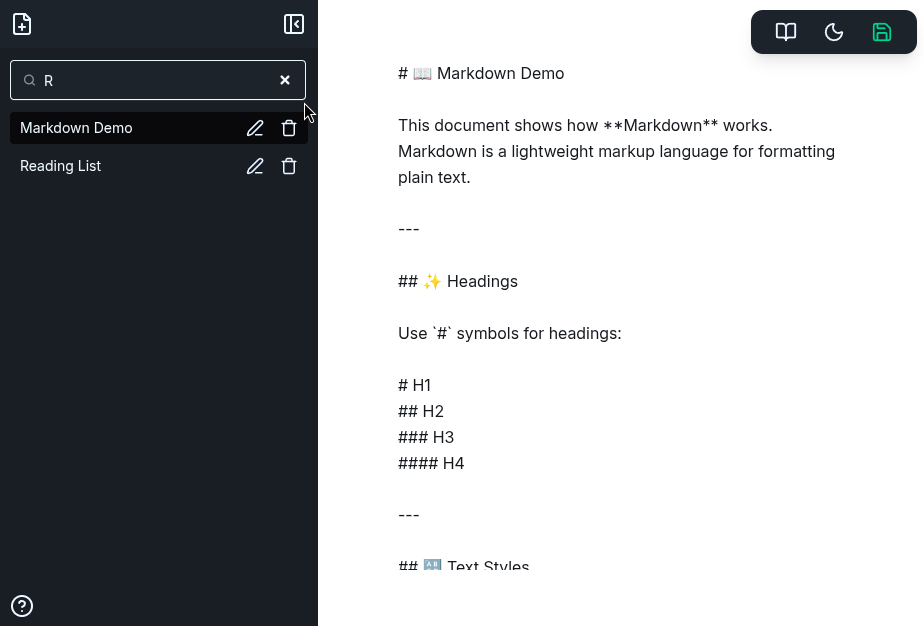
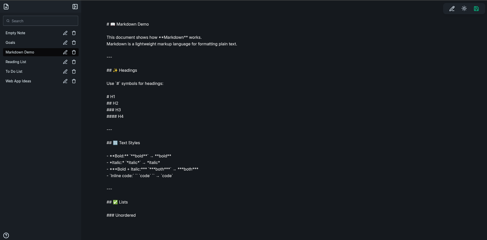
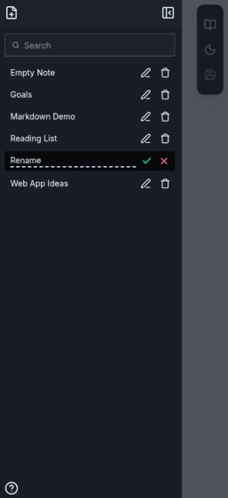
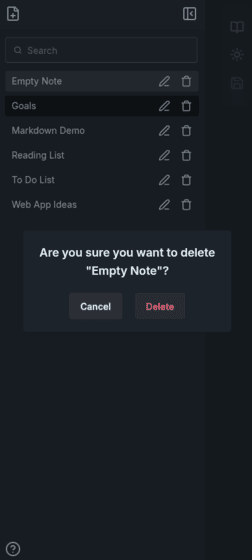

# Notebase

Notebase - A Fast & minimal Markdown note editor on the web with local storage and simple note management


## Features

- Markdown note taking
- Switch between markdown editor and view mode
- Create notes that appear on the sidebar
- Rename & delete notes
- Local storage saving
- Dark/light modes for the editor

## Planned Features

- Pin notes
- Auto-saving
- Drag and drop note menu re-ordering

## Screenshots












## Installation

You can clone the repo and run it locally or visit the website link

```
git clone https://github.com/jamiewilliamsxyz/notebase.git
cd notebase
npm install
npm run dev
```
